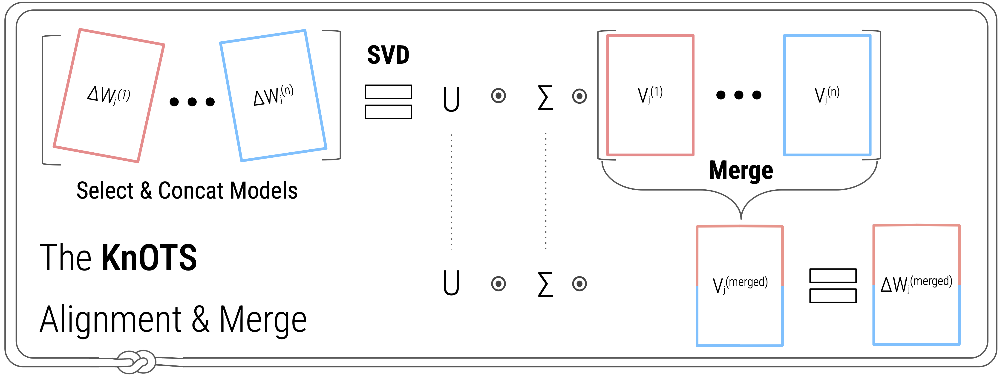

# Model Merging with SVD to Tie the KnOTS

This is the official implementation of **KnOTS** from our paper:

**[Model Merging with SVD to Tie the KnOTS](https://arxiv.org/abs/2410.19735)**  
[George Stoica](https://gstoica27.github.io/)$^{1*}$, 
[Pratik Ramesh](https://www.linkedin.com/in/pratik-ramesh-234471114/)$^{1*}$,
[Boglarka Ecsedi](https://www.linkedin.com/in/boglarka-ecsedi/)$^{1}$,
[Leshem Choshen](https://ktilana.wixsite.com/leshem-choshen)$^2$,
[Judy Hoffman](https://faculty.cc.gatech.edu/~judy/)$^1$

$^1$ Georgia Tech, $^2$ IBM Research \& MIT, \* Equal Contribution.

_[GitHub](https://github.com/gstoica27/KnOTS)_ | _[arXiv](https://arxiv.org/abs/2410.19735)_ | _[BibTeX](#citation)_




## Getting Started
Our repository is built off of python 3, with dependencies defined in the "conda_environment.yaml" file. 
To run any experiment, it is recommended to create an evnironment using the dependencies provided. 
KnOTS relies on pretrained checkpoints to perform merging, and this repository contains several training scripts you can utilize to finetune different models from a common pretrained initializations. 
Additionally, you may also experiment with your own already pre-trained models. 
We also release our model checkpoints [here](https://gtvault-my.sharepoint.com/:f:/g/personal/pramesh39_gatech_edu/ElwcOO7eMGJKmm9QQKchbzIBXd-YvCnFMiBZ7mFDJDXqGw?e=qru79M).

### Installation
Create a virtual environment and install the dependencies:
```bash
conda env update --file conda_environment.yaml --prune
```

## Experiment Pipeline
This repository can train and merge arbitrary LoRA finetuned models based on the [Hugging Face](https://huggingface.co/) library. 
Our repo can be directly used as is for the experiments from our paper.
It can also easily be adapted to many other uses cases by adding a few files to its structure (more information below).

### Currently Supported Applications
We support all experiment settings presented in our paper. 
These include both the ViT and Llama3-8B models, the per-task settings, and our new joint setting.

#### Experiment config
To run an experiment, we first need to decide the configuration. 
The configs directory consists of all our settings, and can easily be extended to new models/settings by simply adding a new config file.
Each config is a python file containing a dictionary of experiment instuctions, and is titled according to the kind of experiment desired.
For instance, "vitB_r16_knots_ties.py" contains instructions for setting up an experiment on the 8 Vision Dataset setting with (1) the ViT-B/32 model architecture, (2) rank 16 LoRA models, and (3) the "KnOTS-TIES" model. 
Please see the configs for more information - including what goes into crafting your own config for external experiments. 
Once you've decided on a config, you can run any experiment by replacing the "config_name" on any file with the name of the config you would like to use.

#### Training
Training models for an experimental suite is straightforward. 
The necessary scripts are provided in the "training_scripts" directory.
Specifically, "8vision_training.py" can be used for training vision experiments, and "nli_training.py" can be used for training language experiments. 
Each scripts comes with a set of default hyperparameters, that you can build upon as desired.
To run an experiment (e.g., 8vision_training.py) you can just enter:
```
$bash: python -m training_scripts.8vision_training
```

#### Evaluation
Any supported experimental suite can be run in one of our eval_scripts directory. 
All scripts record the performance for each model and write the results (+ other attributes) to a csv file.
- 8vision_joint_linearsearch.py: This script conducts a linearsearch to find the best merging parameters for a specified experiment configuration in the new joint setting.
- 8vision_pertask_linearsearch.py: This script conducts a linearsearch to find the best merging parameters for a specified experiment configuration in the benchmark per-task setting.
- nli_pertask_linearsearch.py: This script conducts a linearsearch to find the best merging parameters for a specified experiment configuration in the NLI per-task setting.
- 8vision_joint.py: This script evaluates a specified experiment configuration with set hyperparameters in the new joint setting.
- 8vision_pertask.py: This script evaluates a specified experiment configuration with set hyperparameters in the benchmark per-task setting.

Please see each file for more details on how a model is evaluated. 


### Unsupported Applications
We currently only support applications discussed in our arXiv release. However, this repository can be adapted to new tasks with slight additions to its modular code base. 
Below we breakdown how to change the repository to accommodate each kind of desired task. 

- New Config: Please see [here](https://github.com/gstoica27/KnOTS/blob/main/configs/README.md) for instructions on how to add new configs.
- New Model: Please see [here](https://github.com/gstoica27/KnOTS/blob/main/models/README.md) for instructions on how to add a new model.
- New Dataset: Please see [here](https://github.com/gstoica27/KnOTS/blob/main/dataset/README.md) for instructions on how to add a new dataset.

After filling out the above steps according to your needs, you can directly use any training and evaluation script we currently have provided. 
The only changes required are to alter (1) the hardcoded config_name, and optionally the save directories. 
You can also define your own train/evaluation script and may use our scripts as a template if helpful (with appropriate awknowledgement). 


## Citation

If you use KnOTS or this codebase in your work, please cite: 
```
@article{stoica2024knots,
      title={Model Merging with SVD to Tie the Knots}, 
      author={Stoica, George and Ramesh, Pratik and Ecsedi, Boglarka and Choshen, Leshem and Hoffman, Judy},
      journal={arXiv},
      year={2024},
}
```
